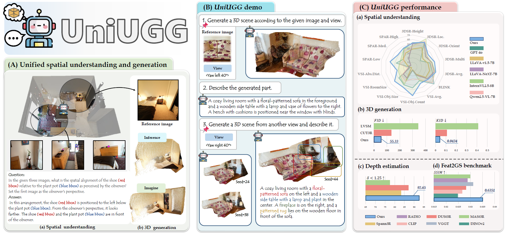

<div align="center" style="font-family: charter;">

<h1>UniUGG: Unified 3D Understanding and Generation via Geometric-Semantic
Encoding</h1>


<a href="https://arxiv.org/abs/2508.11952" target="_blank">
    
</a>
<a href="https://fudan-zvg.github.io/UniUGG/" target="_blank">
    
</a></br>

<div>
    <span>Yueming Xu</span><sup>1&ast;</sup>,
    <span>Jiahui Zhang</span><sup>1&ast;</sup>,
    <span>Ze Huang</span><sup>1&ast;</sup>,
    <span>Yurui Chen</span><sup>1</sup>,
    <span>Yanpeng Zhou</span><sup>2</sup>,
    <span>Zhenyu Chen</span><sup>2</sup>,
    <span>Yu-Jie Yuan</span><sup>2</sup>,
    <span>Pengxiang Xia</span><sup>2</sup>,
    <span>Guowei Huang</span><sup>2</sup>,
    <span>Xinyue Cai</span><sup>2</sup>,
    <span>Zhongang Qi</span><sup>2</sup>,
    <span>Xingyue Quan</span><sup>2</sup>,
    <span>Jianye Hao</span><sup>2</sup>,
    <span>Hang Xu</span><sup>2</sup>,
    </span>
    <a href="https://lzrobots.github.io/" target="_blank">Li Zhang</a><sup>1&dagger;</sup></span>
</div>

<div>
    <sup>1</sup>Fudan University&emsp;
    <sup>2</sup>Huawei Noah’s Ark Lab&emsp;
</div>


<p align="justify" style="font-style: italic;">Overview of our <strong>UniUGG</strong>, the first unified framework for spatial understanding and generation. <b>(A)</b> UniUGG supports spatial-level VQA and generates geometrically consistent 3D scenes. <b>(B)</b> Given a reference image, it can creatively generate 3D variations and describe them accurately. <b>(C)</b> UniUGG outperforms baselines in both spatial understanding and generation, with our specially tuned vision encoder excelling in downstream tasks.
</p>

</div>

## 🎞️ [Demo Video](https://fudan-zvg.github.io/UniUGG/assets/demo.mp4)


## 📚 Bibtex

If you find this project or dataset helpful, please consider citing our paper:

```bibtex
@article{xu2025uniugg,
    title={UniUGG: Unified 3D Understanding and Generation via Geometric-Semantic Encoding},
    author={Xu, Yueming and Zhang, Jiahui and Huang, Ze and Chen, Yurui and Zhou, Yanpeng and Chen Zhenyu and Yuan, Yujie and Xia, Pengxiang and Huang, Guowei and Cai, Xinyue and Qi, Zhongang and Quan, Xingyue and Hao, Jianye and Xu, Hang and Zhang, Li},
    year={2025},
    journal={arXiv preprint arXiv:2508.11952},
}
```